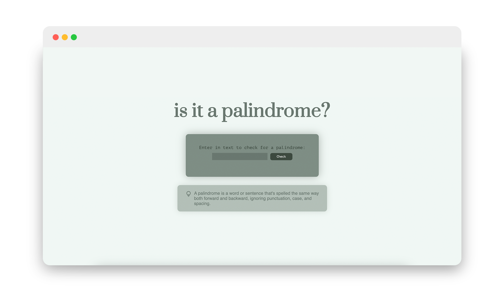
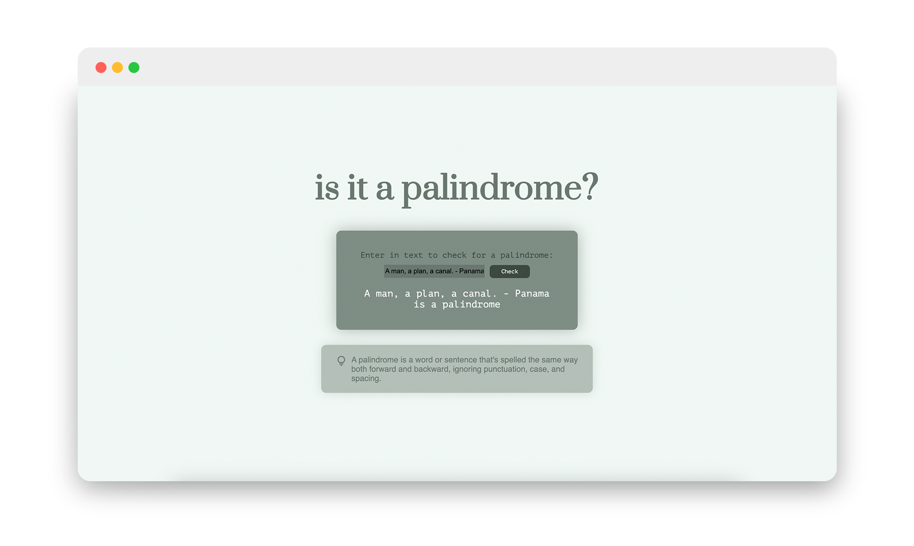

# freeCodeCamp Project 02: Palindrome Checker

I have been following the <b> freeCodeCamp JavaScript Algorithms and Data Structures Program </b>, and the first project it assigns you with creating a palindrome checker using Javascript. I learned how to manipulate the Document Object Model (DOM) to interact with HTML elements. Using document.getElementById, I accessed the textInput and checkButton elements to create an event listener that triggers when checkButton is clicked. 

  

The script processes the input from textInput, cleans it by removing spaces, converting to lowercase, and eliminating non-alphanumeric characters using regular expressions (replace(/[^a-zA-Z0-9]/g, "")). After reversing the cleaned string with split('').reverse().join(''), the script checks if it matches the original cleaned string to determine if it's a palindrome. An error check ensures the input isn't empty, prompting an alert if it is. Results are displayed dynamically using document.getElementById("result-paragraph").textContent. This project enhanced my understanding of JavaScript fundamentals such as event handling, string manipulation, conditional logic, and updating the DOM based on user input and programmatic operations.

  

<h3>JavaScript Concepts Applied
</h3>

- DOM Manipulaiton
- Event Handling
- String Manipulation
  - regular expressions, .split(), .join(), .reverse()
- Error Handling

 
 
Through this project, I've deepened my understanding of how JavaScript interacts with HTML and how to implement common programming tasks such as string manipulation and conditional logic in a web application context. Excited to move onto the next project!
