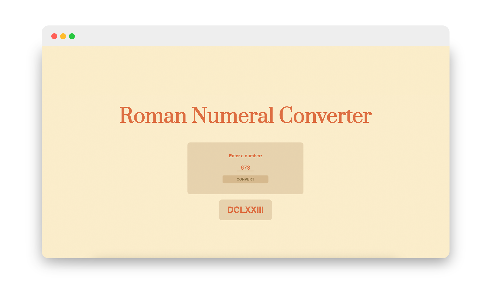

# freeCodeCamp Project 02: Roman Numeral Converter

I have been following the <b> freeCodeCamp JavaScript Algorithms and Data Structures Program </b>, and the second project assigns you with creating a roman numeral conversion app. This JavaScript project was a great learning experience for me. I got hands-on practice with DOM manipulation, using methods like `getElementById` to interact with elements in the HTML document. Setting up event handling with `addEventListener` for the conversion button (`convertButton`) was crucial, as it triggered the `convertNumber` function when clicked. I also tackled input validation, ensuring users entered valid numbers within the range of 1 to 3999, displaying appropriate messages through `output.innerHTML`. The heart of the project involved developing an algorithm to convert numbers to Roman numerals. I used loops to iterate through a predefined list of numeral values, employing conditional logic and `while` loops to handle subtraction when necessary. Ultimately, I successfully displayed the converted Roman numeral string back to the user, consolidating my skills in problem-solving and JavaScript programming for web applications.

  

