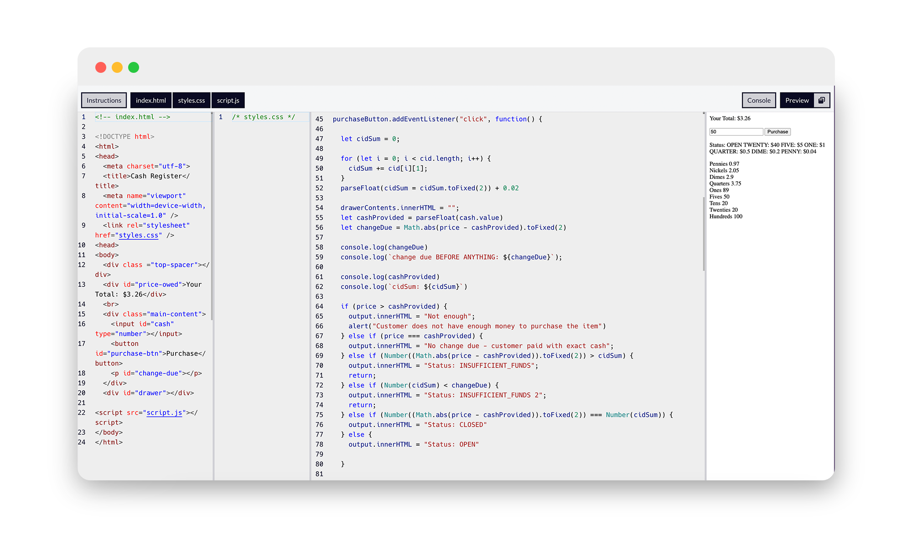

# freeCodeCamp Project 04: Cash Register

This JavaScript project exemplifies fundamental programming concepts essential for interactive web applications, specifically focusing on managing cash register transactions. Key learnings include mastering variable declaration and initialization using let and const, which were used to store diverse data types such as numbers, arrays (cid and labels), and references to HTML elements obtained via document.getElementById.

Event handling was central to the application's functionality, demonstrated through the addEventListener method. This facilitated responsiveness by triggering a function upon a button click (purchaseButton), which calculated change due and updated the display accordingly based on user input. Data manipulation and calculations were critical components, employing JavaScript methods (toFixed()) to maintain precision with monetary values and operators (+=, -=) for iterative calculations. Conditional statements (if, else if, else) provided logic to handle various transaction scenarios, including checking for sufficient funds, exact payment, or closure of the transaction. Loops (for) were pivotal in iterating through currency denominations (k) to compute and distribute change from the cash drawer (cid). This iterative process dynamically updated the cid array and HTML content (innerHTML) to reflect transaction outcomes, enhancing understanding of dynamic content management in web applications.

Comments and (lots of) debugging techniques were utilized throughout, illustrating best practices for code clarity and troubleshooting. This exercise consolidated skills in JavaScript programming, emphasizing data manipulation, event handling, conditional logic, and iterative processing—fundamental skills crucial for developing responsive and user-friendly web applications that interactively manage transactions and user inputs.

  

Note: no CSS was applied to this project to move onto the next!

 
 

<h3>JavaScript Concepts Applied
</h3>

- price: Stores the price of the item.
- cid: Array of arrays containing currency denominations and amounts.
- abels: Array of strings representing labels for currency denominations.
- cash: Reference to an HTML input element "cash" for entering cash provided by the customer.
- purchaseButton: Reference to an HTML button element "purchase-btn" for initiating the transaction.
- output: Reference to an HTML element "change-due" for displaying transaction outcomes.
- drawerContents: Reference to an HTML element "drawer" for displaying the contents of the cash drawer.
- document.getElementById(): Retrieves references to HTML elements by their ID.
- addEventListener(): Listens for events (e.g., click) on an HTML element and executes a function in response.
- parseFloat(): Converts a string to a floating-point number.
- Math.floor(): Rounds a number down to the nearest integer.
- Arithmetic operators (+=, -=): Used for cumulative calculations and adjustments.
- Comparison operators (>, ===, <): Used in conditional statements to evaluate conditions.
- push(): Adds elements to an array (drawerContents.innerHTML += ...).
- Conditional statements (if, else if, else): Control the flow of execution based on different conditions
- for loop: Iterates through arrays (cid and labels) to perform calculations and update HTML content.
- Number(): Converts a value to a number.
- toFixed(): Converts a number to a string, keeping a specified number of decimals.
- innerHTML: Property used to get or set the HTML content inside an element.