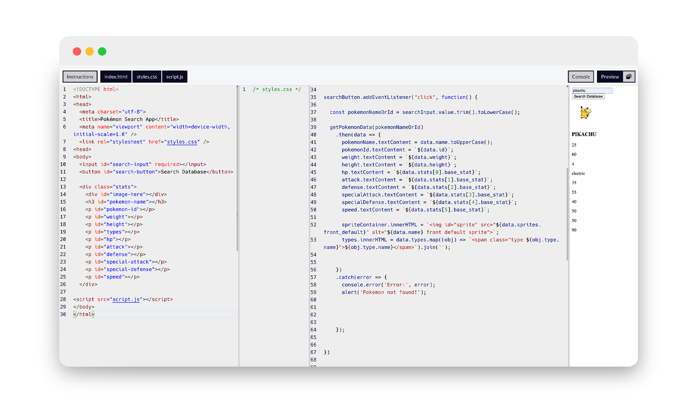

# freeCodeCamp Project 05: Pokemon Search API Project

Through this JavaScript program, I've significantly advanced my proficiency across several critical areas. Utilizing async functions and await for handling asynchronous operations, particularly fetching data from an external API with the fetch API, has deepened my understanding of asynchronous programming. This approach ensures responsive and efficient data retrieval. Robust error handling, implemented through try/catch blocks, has been crucial in managing exceptions during data fetching, ensuring the application can gracefully provide feedback to users even in the face of unexpected errors.

Manipulating the DOM dynamically has showcased my ability to update webpage elements based on user interactions and API responses. Event listeners like addEventListener seamlessly integrate user actions, such as button clicks, with data retrieval and display processes.

  

Note: no CSS was applied to this project to move onto the next!

 
 

Additionally, using template literals (${...}) for string interpolation and formatting has enhanced my capability to update text content and attributes within HTML elements dynamically. Techniques like mapping data to HTML elements and joining them into cohesive strings have effectively presented complex data, such as Pokémon types, in a user-friendly format.

Integrating with an external API has broadened my skills in handling HTTP requests, processing API responses, and parsing JSON data to extract relevant information for display. Encountering and resolving various runtime errors, from HTTP errors like 404s when a Pokémon is not found to JavaScript exceptions like null pointer errors, has strengthened my debugging abilities and underscored the importance of thorough testing and error handling.

<h3>JavaScript Concepts Applied
</h3>

- async functions and await for asynchronous operations
- await fetch()
- .then
- .catch 
- Error handling with try/catch blocks
- Fetch API for HTTP requests to an external API
- DOM manipulation for updating HTML elements
- Event listeners (addEventListener) for user interactions
- Template literals (${...}) for dynamic string handling
- Array methods (e.g., map) for data transformation
- JSON parsing for extracting data from API responses

 

Overall, this project has demonstrated my ability to harmoniously leverage advanced JavaScript features and techniques, resulting in a cohesive application that dynamically retrieves, processes, and displays data based on user input while maintaining code reliability and enhancing user satisfaction.

Also completed another freeCodeCamp Certificate! Yay!

 `:)`